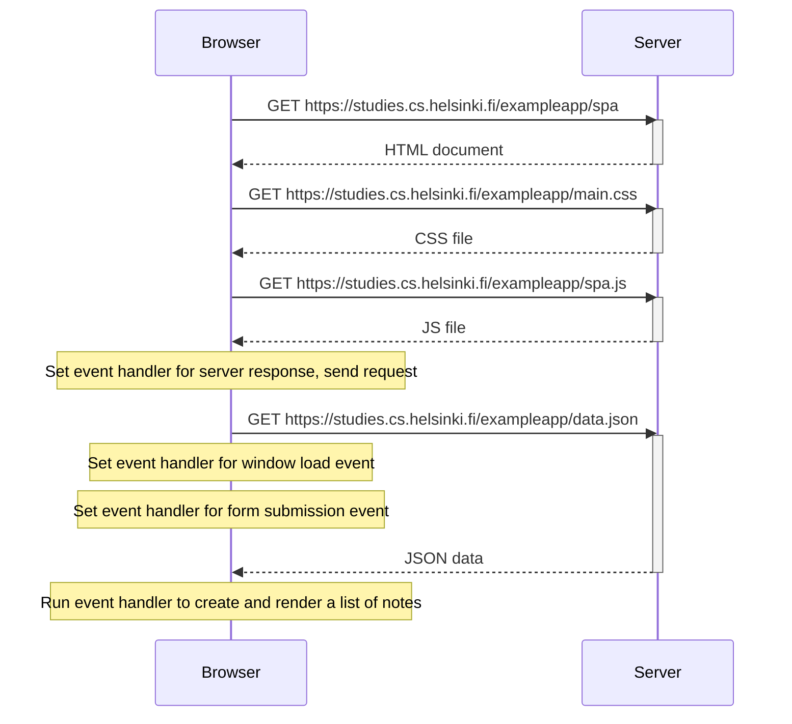

```mermaid
sequenceDiagram
  participant Browser
  participant Server

  Browser->>Server: GET https://studies.cs.helsinki.fi/exampleapp/spa
  activate Server
  Server-->>Browser: HTML document
  deactivate Server

  Browser->>Server: GET https://studies.cs.helsinki.fi/exampleapp/main.css
  activate Server
  Server-->>Browser: CSS file
  deactivate Server

  Browser->>Server: GET https://studies.cs.helsinki.fi/exampleapp/spa.js
  activate Server
  Server-->>Browser: JS file
  deactivate Server

  Note over Browser: Set event handler for server response, send request
  Browser->>Server: GET https://studies.cs.helsinki.fi/exampleapp/data.json
  activate Server
  Note over Browser: Set event handler for window load event
  Note over Browser: Set event handler for form submission event
  Server-->>Browser: JSON data
  deactivate Server
  Note over Browser: Run event handler to create and render a list of notes
```
