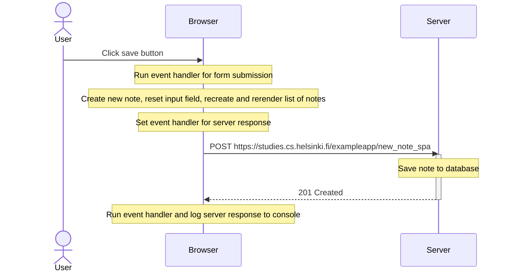

```mermaid
sequenceDiagram
  actor User
  participant Browser
  participant Server

  User->>Browser: Click save button

  Note over Browser: Run event handler for form submission
  Note over Browser: Create new note, reset input field, recreate and rerender list of notes

  Note over Browser: Set event handler for server response
  Browser->>Server: POST https://studies.cs.helsinki.fi/exampleapp/new_note_spa
  activate Server
  Note over Server: Save note to database
  Server-->>Browser: 201 Created
  deactivate Server
  Note over Browser: Run event handler and log server response to console
```
