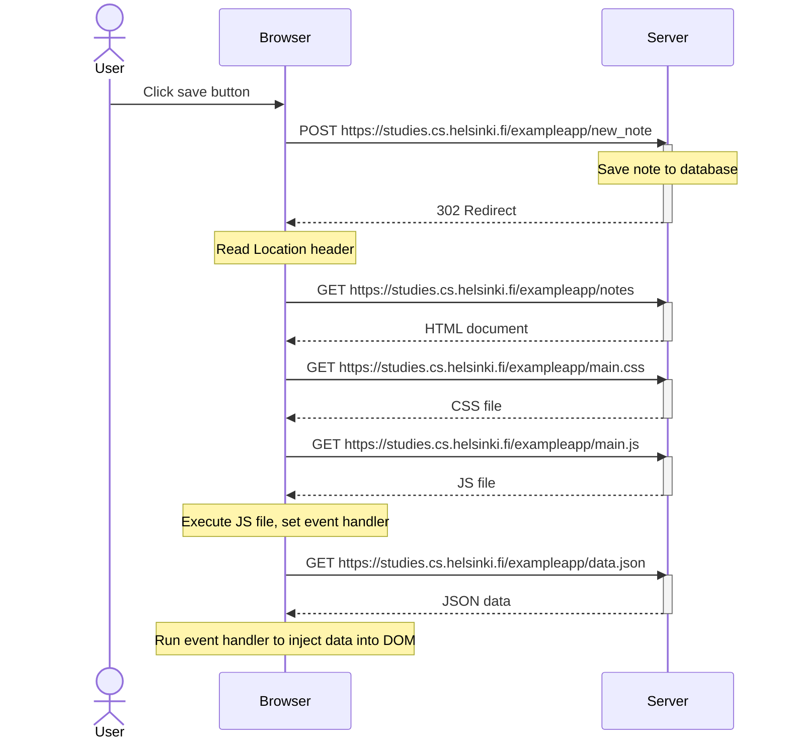

```mermaid
sequenceDiagram
  actor User
  participant Browser
  participant Server

  User->>Browser: Click save button

  Browser->>Server: POST https://studies.cs.helsinki.fi/exampleapp/new_note
  activate Server
  Note over Server: Save note to database
  Server-->>Browser: 302 Redirect
  deactivate Server

  Note over Browser: Read Location header
  Browser->>Server: GET https://studies.cs.helsinki.fi/exampleapp/notes
  activate Server
  Server-->>Browser: HTML document
  deactivate Server

  Browser->>Server: GET https://studies.cs.helsinki.fi/exampleapp/main.css
  activate Server
  Server-->>Browser: CSS file
  deactivate Server

  Browser->>Server: GET https://studies.cs.helsinki.fi/exampleapp/main.js
  activate Server
  Server-->>Browser: JS file
  deactivate Server

  Note over Browser: Execute JS file, set event handler
  Browser->>Server: GET https://studies.cs.helsinki.fi/exampleapp/data.json
  activate Server
  Server-->>Browser: JSON data
  deactivate Server

  Note over Browser: Run event handler to inject data into DOM
```